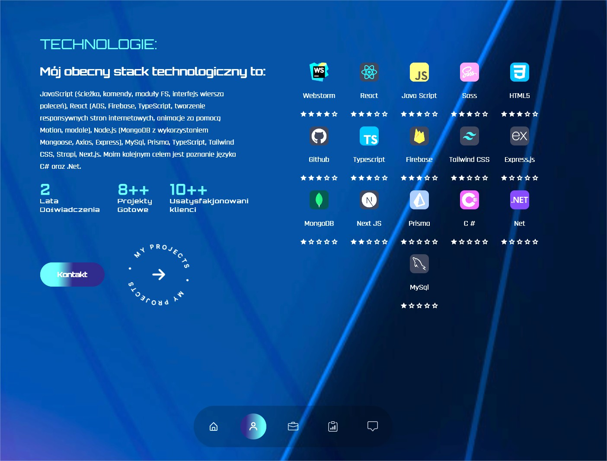
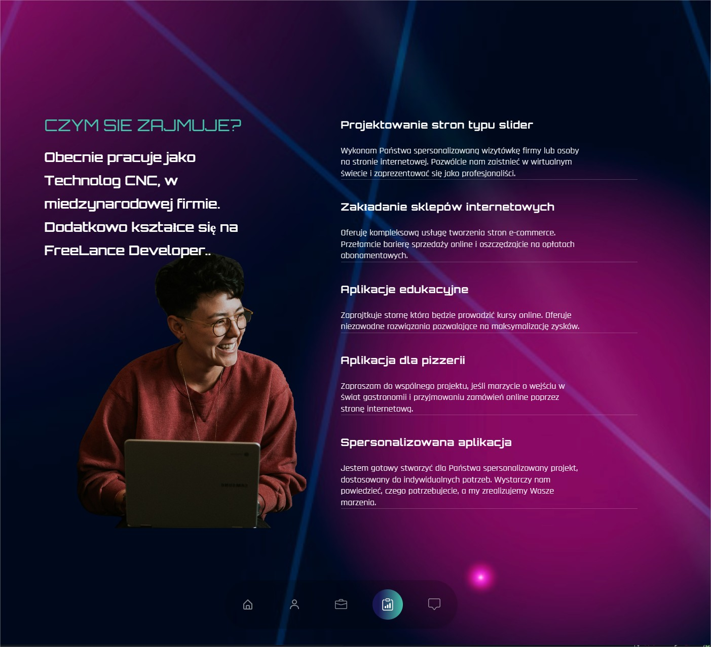
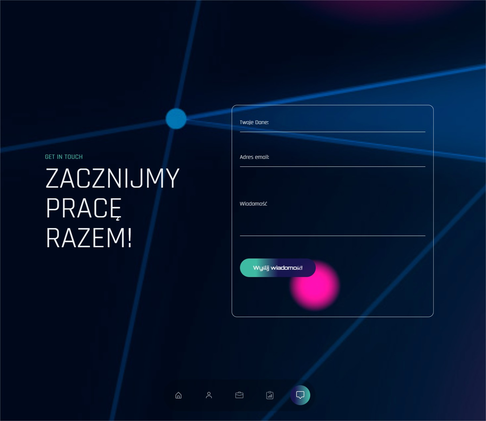
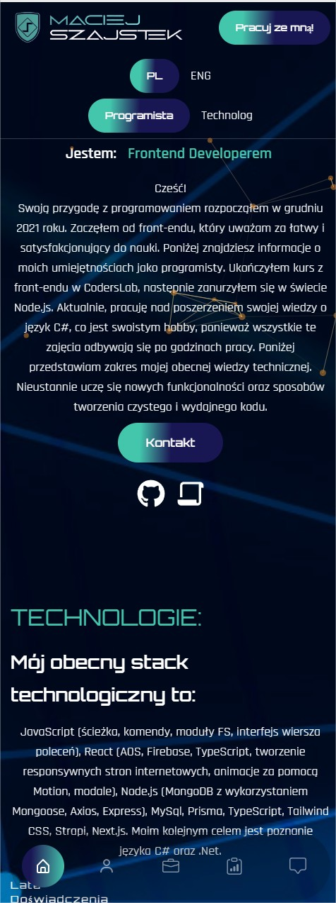
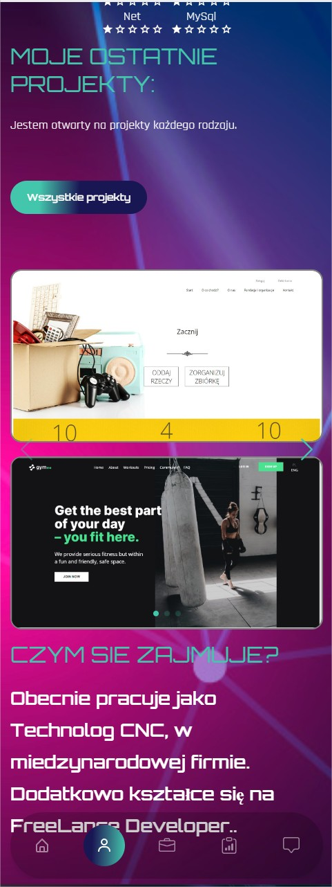
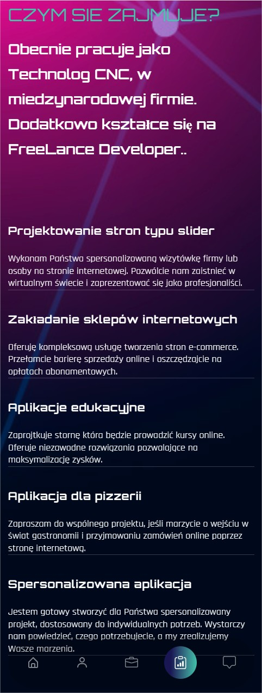
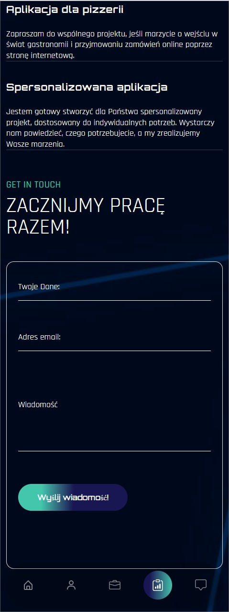

# Welcome to Portfolio Private WebSite:

My portfolio showcases a diverse range of projects that I have had the privilege to work on. It reflects my journey as a web developer and my continuous pursuit of new challenges. Whether it's creating captivating websites, developing interactive web applications, or optimizing user experiences, I approach each project with a passion for innovation and a commitment to excellence.*

## Features

* Navigation on bar
* DataBase
* Validations on formulas
* Search Bar
* Navigation searching
* Test payment on strape
* Emial Sender
* Picker Prof
* Switch
* Modal

## Technologies

* React Scroll
* React Switch
* Motion div
* Count
* Tailwind css
* Typescript
* React: react-router
* Data Typescript
* Custom hook
    - useState
    - useEffect
    - useContext
    - useParams
    - useRef
* Responsive design
* Props validations
* Animations

## Desktop

## Main section

 

## About Section
  

## Work section

## Contact section

## Mobile

## Main section

 

## Prerequisites
* Before getting started, make sure you have the Node.js and npm or yarn
* Clone this repository to your local machine
* Navigate to the project directory
* Install the project dependencies by running npm install or yarn install
* Start the development server npm start or yarn start
* Bash on folder Api to run strapi
* Open your browser and visit your localhost:3000 to see the running application.